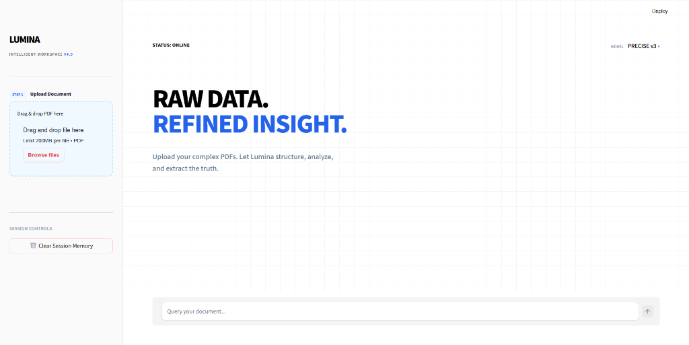
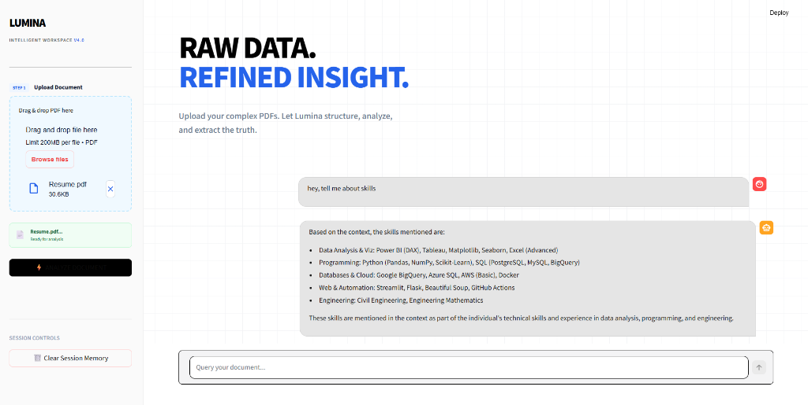
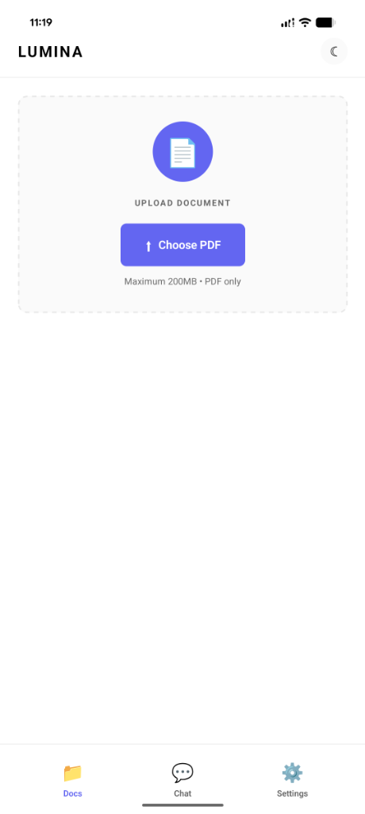
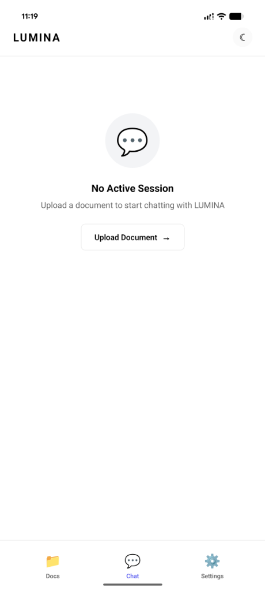
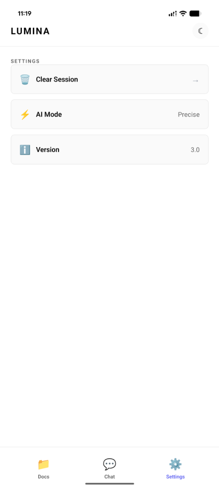

# ⚡ LUMINA - Intelligent File Reader

<div align="center">
  <h3>🤖 Your AI-Powered Document Assistant</h3>
  <p>Upload PDFs and chat with your documents using advanced RAG (Retrieval-Augmented Generation) technology</p>
  
  
  
  
  
  [](https://codecov.io/gh/Pranit-satnurkar/LUMINA-INTELLIGENT-FILE-READER-)
</div>

---

## 📖 Overview

**LUMINA** is an intelligent document reader that leverages cutting-edge AI technology to help you interact with your PDF documents through natural language conversations. Built with a robust RAG architecture, LUMINA combines the power of LangChain, Groq LLM, and FAISS vector search to provide accurate, context-aware responses to your questions.

### 🎯 Key Highlights

- **Advanced RAG Pipeline**: Hybrid search combining FAISS vector similarity and BM25 ranking
- **Multi-Platform**: Web interface (Streamlit) + Mobile app (React Native/Expo)
- **Intelligent Processing**: Recursive character splitting for context preservation
- **Security-First**: Pydantic guardrails, conversation sandboxing, and prompt isolation
- **Evaluation Metrics**: RAGAS integration for faithfulness, relevancy, and context recall
- **Expert Tools**: Specialized document analysis capabilities

---

## ✨ Features

### 🚀 Core Functionality
- 📄 **PDF Upload & Processing** - Support for multiple PDF documents with intelligent chunking
- 💬 **AI Chat Interface** - Natural language conversations about your documents
- 🔍 **Hybrid Search** - Combined vector similarity (FAISS) and keyword search (BM25)
- 🎯 **Context-Aware Responses** - Maintains conversation history for coherent interactions
- ⚡ **Fast Inference** - Powered by Groq's lightning-fast LLM API

### 🎨 User Experience
- 🌙 **Dark/Light Mode** - Beautiful themes for comfortable reading
- 📱 **Mobile App** - Native Android experience with React Native
- 🖥️ **Web Interface** - Streamlit-based dashboard for desktop users
- 💾 **Session Management** - Persistent chat history and document context

### 🔒 Security & Quality
- ✅ **HTTPS Encryption** - Secure API communication
- ✅ **Conversation Sandbox** - Isolated execution environment
- ✅ **Pydantic Guardrails** - Input validation and type safety
- ✅ **RAGAS Evaluation** - Quality metrics for response accuracy
- ✅ **No Data Persistence** - Documents processed in-memory only

---

## 📸 Screenshots

### Web Interface

<div align="center">

**Home & Upload Interface**



**AI Chat with Document Analysis**



</div>

### Mobile App

<div align="center">

**Document Upload**



**Chat Interface**



**Settings**



</div>

---

## 🏗️ Architecture


```
┌─────────────────────────────────────────────────────────────┐
│                      LUMINA Architecture                     │
├─────────────────────────────────────────────────────────────┤
│                                                              │
│  ┌──────────────┐         ┌──────────────┐                 │
│  │   Mobile App │         │ Web Interface│                 │
│  │ (React Native)│         │  (Streamlit) │                 │
│  └──────┬───────┘         └──────┬───────┘                 │
│         │                         │                          │
│         └─────────┬───────────────┘                          │
│                   │                                          │
│         ┌─────────▼─────────┐                               │
│         │   FastAPI Backend  │                               │
│         │  ┌──────────────┐ │                               │
│         │  │  Security    │ │                               │
│         │  │  Layer       │ │                               │
│         │  └──────┬───────┘ │                               │
│         │         │          │                               │
│         │  ┌──────▼───────┐ │                               │
│         │  │ LangChain    │ │                               │
│         │  │ Agent        │ │                               │
│         │  └──────┬───────┘ │                               │
│         │         │          │                               │
│         │  ┌──────▼───────┐ │                               │
│         │  │ PDF Processor│ │                               │
│         │  └──────┬───────┘ │                               │
│         └─────────┼─────────┘                               │
│                   │                                          │
│         ┌─────────▼─────────┐                               │
│         │  Hybrid Search     │                               │
│         │  ┌──────┐ ┌─────┐ │                               │
│         │  │FAISS │ │BM25 │ │                               │
│         │  └──────┘ └─────┘ │                               │
│         └───────────────────┘                               │
│                   │                                          │
│         ┌─────────▼─────────┐                               │
│         │   Groq LLM API    │                               │
│         └───────────────────┘                               │
│                                                              │
└─────────────────────────────────────────────────────────────┘
```

---

## 🚀 Tech Stack

### Backend
| Technology | Purpose |
|-----------|---------|
| **FastAPI** | Modern Python web framework for API endpoints |
| **LangChain** | LLM orchestration and RAG pipeline |
| **LangGraph** | Agent workflow management |
| **Groq** | Ultra-fast LLM inference (llama-3.3-70b-versatile) |
| **FAISS** | Vector similarity search (Facebook AI) |
| **Sentence Transformers** | Document embeddings (all-MiniLM-L6-v2) |
| **BM25** | Keyword-based ranking algorithm |
| **PDFPlumber** | PDF text extraction |
| **Pydantic** | Data validation and settings management |
| **RAGAS** | RAG evaluation metrics |

### Frontend
| Technology | Purpose |
|-----------|---------|
| **React Native** | Cross-platform mobile framework |
| **Expo** | Development and build platform |
| **Streamlit** | Web dashboard interface |
| **Axios** | HTTP client for API calls |

### DevOps & Tools
| Technology | Purpose |
|-----------|---------|
| **Uvicorn** | ASGI server for FastAPI |
| **Gunicorn** | Production WSGI server |
| **Python-dotenv** | Environment variable management |
| **Git** | Version control |

---

## 📦 Project Structure

```
RAG-Powered-Chatbot/
├── backend/                    # FastAPI backend service
│   ├── main.py                # API endpoints and server setup
│   ├── bot.py                 # LangChain agent and RAG logic
│   ├── pdf_processor.py       # PDF parsing and chunking
│   ├── expert_tools.py        # Specialized document tools
│   ├── security_layer.py      # Security and validation
│   └── faiss_index/           # Vector database storage
│
├── mobile-app/                # React Native mobile application
│   ├── App.js                 # Main mobile app component
│   ├── app.json               # Expo configuration
│   ├── eas.json               # EAS Build configuration
│   └── assets/                # App icons and images
│
├── api/                       # Additional API utilities
├── docs/                      # Documentation files
├── scripts/                   # Utility scripts
│
├── app.py                     # Streamlit web interface
├── ingest.py                  # Document ingestion pipeline
├── evaluate.py                # RAGAS evaluation script
├── hybrid_search.py           # Hybrid search implementation
│
├── requirements.txt           # Python dependencies
├── .env                       # Environment variables (not in repo)
├── .gitignore                # Git ignore rules
└── README.md                  # This file
```

---

## 🛠️ Installation & Setup

### Prerequisites
- Python 3.8 or higher
- Node.js 16+ and npm (for mobile app)
- Git
- Groq API key ([Get it here](https://console.groq.com))

### Backend Setup

1. **Clone the repository**
```bash
git clone https://github.com/Pranit-satnurkar/LUMINA-INTELLIGENT-FILE-READER-.git
cd LUMINA-INTELLIGENT-FILE-READER-
```

2. **Create virtual environment**
```bash
python -m venv venv

# Windows
venv\Scripts\activate

# macOS/Linux
source venv/bin/activate
```

3. **Install dependencies**
```bash
pip install -r requirements.txt
```

4. **Configure environment variables**
```bash
# Create .env file
echo GROQ_API_KEY=your_groq_api_key_here > .env
```

5. **Run the backend server**
```bash
# Development mode
uvicorn backend.main:app --reload --host 0.0.0.0 --port 8000

# Or use the Streamlit interface
streamlit run app.py
```

### Mobile App Setup

1. **Navigate to mobile app directory**
```bash
cd mobile-app
```

2. **Install dependencies**
```bash
npm install
```

3. **Update API endpoint**
```javascript
// In App.js, update the API_URL to your backend URL
const API_URL = 'http://your-backend-url:8000';
```

4. **Start Expo development server**
```bash
npx expo start
```

5. **Run on device**
- Install Expo Go app on your Android/iOS device
- Scan the QR code from the terminal
- Or press `a` for Android emulator, `i` for iOS simulator

---

## 📱 Usage

### Web Interface (Streamlit)

1. Start the Streamlit app:
```bash
streamlit run app.py
```

2. Open your browser at `http://localhost:8501`

3. Upload PDF documents using the sidebar

4. Ask questions in the chat interface

### Mobile App

1. Launch the app on your device

2. Tap the "Upload PDF" button

3. Select a PDF from your device

4. Start chatting with your document!

### API Endpoints

```bash
# Health check
GET http://localhost:8000/health

# Upload PDF
POST http://localhost:8000/api/upload
Content-Type: multipart/form-data
Body: file=<pdf_file>

# Chat with document
POST http://localhost:8000/api/chat
Content-Type: application/json
Body: {
  "message": "What is this document about?",
  "session_id": "unique-session-id"
}
```

---

## 🧪 Evaluation & Testing

LUMINA uses **RAGAS** (Retrieval-Augmented Generation Assessment) for quality evaluation:

```bash
# Run evaluation
python evaluate.py
```

### Metrics Tracked
- **Faithfulness**: How accurate are the responses based on retrieved context?
- **Answer Relevancy**: How relevant are the answers to the questions?
- **Context Recall**: How well does the system retrieve relevant context?
- **Context Precision**: How precise is the retrieved context?

**Target**: Faithfulness score > 0.9

---

## 🔐 Security Features

1. **Conversation Sandbox**: Bot is restricted from accessing system prompts or unauthorized files
2. **Pydantic Guardrails**: Type validation and input sanitization
3. **HTTPS Encryption**: All API communications are encrypted
4. **No Data Persistence**: Documents are processed in-memory only
5. **Environment Variables**: Sensitive keys stored securely
6. **CORS Configuration**: Controlled cross-origin access

---

## 🎯 Roadmap

- [x] Core RAG pipeline with FAISS + BM25
- [x] Mobile app with React Native
- [x] Web interface with Streamlit
- [x] RAGAS evaluation integration
- [x] Security layer implementation
- [ ] Multi-document conversation support
- [ ] OCR for scanned PDFs
- [ ] Support for DOCX, TXT, and other formats
- [ ] Cloud deployment (Railway/Render)
- [ ] User authentication
- [ ] Document annotation features

---

## 🤝 Contributing

Contributions are welcome! Please follow these steps:

1. Fork the repository
2. Create a feature branch (`git checkout -b feature/AmazingFeature`)
3. Commit your changes (`git commit -m 'Add some AmazingFeature'`)
4. Push to the branch (`git push origin feature/AmazingFeature`)
5. Open a Pull Request

---

## 📄 License

This project is licensed under the MIT License - see the [LICENSE](LICENSE) file for details.

---

## 🙏 Acknowledgments

- **LangChain** - For the amazing RAG framework
- **Groq** - For lightning-fast LLM inference
- **Facebook AI** - For FAISS vector search
- **Expo** - For simplifying React Native development
- **Streamlit** - For the beautiful web interface

---

## 📧 Contact

**Pranit Satnurkar**

- GitHub: [@Pranit-satnurkar](https://github.com/Pranit-satnurkar)
- Repository: [LUMINA-INTELLIGENT-FILE-READER-](https://github.com/Pranit-satnurkar/LUMINA-INTELLIGENT-FILE-READER-)

---

<div align="center">
  <p><strong>⚡ Built with passion using Google Antigravity & Gemini 3 Pro</strong></p>
  <p>⭐ Star this repo if you find it useful!</p>
  <p>Made with ❤️ for the AI community</p>
</div>
